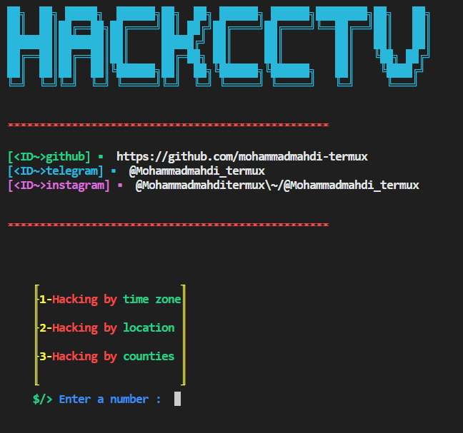

# hackCCTV

Note: ⚠️Mandatory update to fix bugs,please delete the previous version with the ```rm -r hackCCTV``` command and install the new version⚠️

### 🦭The cost of the tool is one star on MyGitHub🌟

## ID me📧

telegram
>@ShareToolBuffViewTikTok

telergram admin 
>@NAMASTEHACKINGKH


## prerequisite🗃
```bash
python3
```
## Installation📥

```bash
pkg update && pkg upgrade
```

```bash
git clone https://github.com/namastehacing/HACKCCTV_KH
```

```bash
cd hackCCTV
```

```bash
python3 hackcctv.py
```


## photo📷


